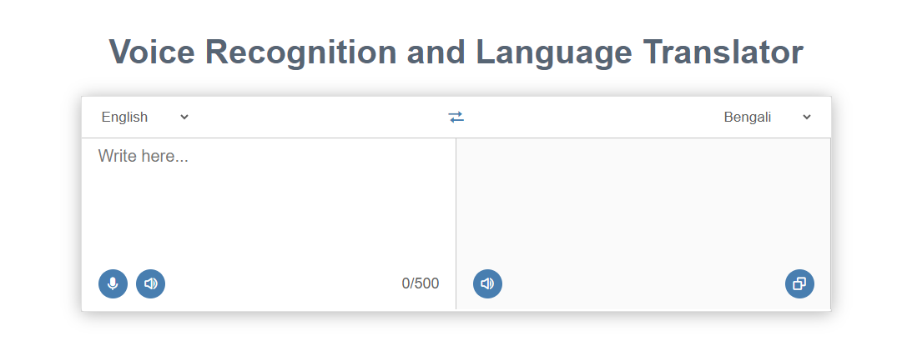

# Voice Recognition and Language Translator

## Description

Welcome to the Voice Recognition and Language Translator app! This application allows you to translate text to any language and also offers voice translation and voice recognition features. Whether you're traveling, learning a new language, or simply need quick translations, this app has you covered.

## Live Demo

Check out the live site: [Voice Recognition and Language Translator](https://sadi-tanvir.github.io/Voice-Recognition-and-Language-Translator/)

## Features

- **Language Translation:** Translate text to any language quickly and easily.
- **Voice Translation:** Convert spoken language into text and translate it.
- **Voice Recognition:** Capture spoken language and convert it into text.
- **Copy to Clipboard:** Easily copy the translated text or recognized text to the clipboard.

## Screenshots

